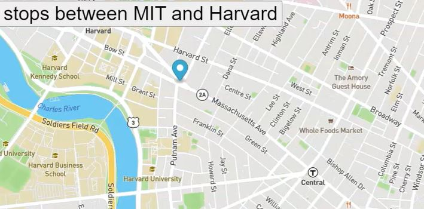

# Real-Time-Bus-Tracking
<h1>Real Time Bus Tracking</h1>

<a href="http://somup.com/crjTnNr1ZR">Video preview</a>
<h2>DESCRIPTION</h2>

This project uses vanilla JavaScript with Mapbox as a tool to view real time map data 
tracking the bus route from MIT and Harvard.

<h3>Possible future improvements</h3>

To implement GPS tracking and some tool to count the time between one stop and another data

